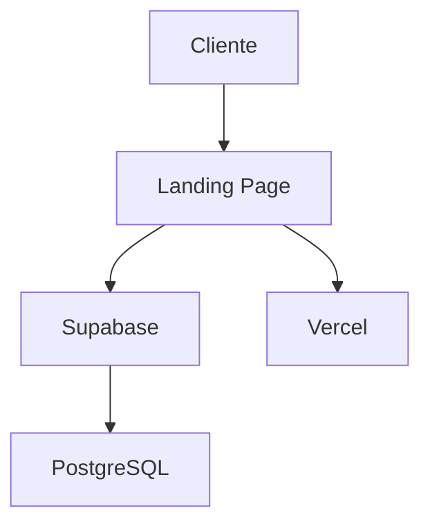

# 🤖 AUTOMAÇÕES COMPLETAS - PROJETO ELEVARE
## Lista Exaustiva de Tudo que Pode Ser Automatizado (Zero Intervenção Humana)

**Data:** 28/11/2025  
**Projeto:** Elevare Landing Page + Backend  
**Contexto:** SaaS B2B para clínicas de estética

---

## 📋 ÍNDICE

1. [CI/CD e Deploy](#1-cicd-e-deploy)
2. [Testes Automatizados](#2-testes-automatizados)
3. [Qualidade de Código](#3-qualidade-de-código)
4. [Segurança e Compliance](#4-segurança-e-compliance)
5. [Infraestrutura](#5-infraestrutura)
6. [Monitoramento e Observabilidade](#6-monitoramento-e-observabilidade)
7. [Gestão de Dependências](#7-gestão-de-dependências)
8. [Documentação](#8-documentação)
9. [Performance](#9-performance)
10. [Backup e Disaster Recovery](#10-backup-e-disaster-recovery)
11. [Notificações e Alertas](#11-notificações-e-alertas)
12. [Ambientes Efêmeros](#12-ambientes-efêmeros)
13. [Análise de Dados](#13-análise-de-dados)
14. [Acessibilidade e SEO](#14-acessibilidade-e-seo)
15. [Compliance e Auditoria](#15-compliance-e-auditoria)

---

## 1. CI/CD E DEPLOY

### 1.1 Pipeline de Integração Contínua

**O que automatizar:**
- ✅ Build automático a cada commit
- ✅ Execução de testes unitários
- ✅ Execução de testes de integração
- ✅ Análise de código estático (linting)
- ✅ Verificação de formatação (Prettier)
- ✅ Geração de relatórios de cobertura
- ✅ Validação de variáveis de ambiente

**Implementação:**
```yaml
# .github/workflows/ci.yml
name: CI Pipeline
on: [push, pull_request]
jobs:
  test:
    runs-on: ubuntu-latest
    steps:
      - uses: actions/checkout@v4
      - uses: actions/setup-node@v4
        with:
          node-version: '20'
      - run: npm ci
      - run: npm run lint
      - run: npm run format:check
      - run: npm test -- --coverage
      - run: node frontend-landing/validate-env.js
      - uses: codecov/codecov-action@v3
```

### 1.2 Deploy Automático

**O que automatizar:**
- ✅ Deploy para staging a cada merge em `develop`
- ✅ Deploy para production a cada merge em `master`
- ✅ Deploy de preview para cada PR
- ✅ Rollback automático em caso de falha
- ✅ Invalidação de cache CDN
- ✅ Warm-up de instâncias

**Implementação:**
```yaml
# .github/workflows/deploy.yml
name: Deploy
on:
  push:
    branches: [master, develop]
jobs:
  deploy:
    runs-on: ubuntu-latest
    steps:
      - uses: actions/checkout@v4
      - uses: amondnet/vercel-action@v25
        with:
          vercel-token: ${{ secrets.VERCEL_TOKEN }}
          vercel-org-id: ${{ secrets.VERCEL_ORG_ID }}
          vercel-project-id: ${{ secrets.VERCEL_PROJECT_ID }}
          vercel-args: '--prod'
```

### 1.3 Versionamento Semântico Automático

**O que automatizar:**
- ✅ Geração automática de versão (SemVer)
- ✅ Criação de tags Git
- ✅ Geração de CHANGELOG.md
- ✅ Criação de GitHub Releases

**Implementação:**
```yaml
# .github/workflows/release.yml
name: Release
on:
  push:
    branches: [master]
jobs:
  release:
    runs-on: ubuntu-latest
    steps:
      - uses: actions/checkout@v4
      - uses: cycjimmy/semantic-release-action@v4
        env:
          GITHUB_TOKEN: ${{ secrets.GITHUB_TOKEN }}
```

---

## 2. TESTES AUTOMATIZADOS

### 2.1 Testes Unitários

**O que automatizar:**
- ✅ Execução a cada commit
- ✅ Geração de relatório de cobertura
- ✅ Falha se cobertura < 80%
- ✅ Testes de mutação (mutation testing)

**Implementação:**
```json
// package.json
{
  "scripts": {
    "test": "jest --coverage --coverageThreshold='{\"global\":{\"branches\":80,\"functions\":80,\"lines\":80,\"statements\":80}}'",
    "test:mutation": "stryker run"
  }
}
```

### 2.2 Testes de Integração

**O que automatizar:**
- ✅ Testes de API (endpoints)
- ✅ Testes de banco de dados
- ✅ Testes de autenticação
- ✅ Testes de fluxos completos

**Implementação:**
```javascript
// tests/integration/api.test.js
describe('API Integration Tests', () => {
  beforeAll(async () => {
    await setupTestDatabase();
  });
  
  test('POST /api/v1/leads - should create lead', async () => {
    const response = await request(app)
      .post('/api/v1/leads')
      .send({ email: 'test@example.com' });
    expect(response.status).toBe(201);
  });
});
```

### 2.3 Testes E2E (End-to-End)

**O que automatizar:**
- ✅ Testes de fluxo de usuário
- ✅ Testes de formulários
- ✅ Testes de navegação
- ✅ Screenshots automáticos em falhas
- ✅ Gravação de vídeo de testes

**Implementação:**
```javascript
// tests/e2e/lead-capture.spec.js
import { test, expect } from '@playwright/test';

test('should capture lead', async ({ page }) => {
  await page.goto('https://elevare-landing.vercel.app');
  await page.fill('input[name="email"]', 'test@example.com');
  await page.click('button[type="submit"]');
  await expect(page.locator('.success-message')).toBeVisible();
});
```

### 2.4 Testes de Performance

**O que automatizar:**
- ✅ Lighthouse CI a cada deploy
- ✅ Testes de carga (k6, Artillery)
- ✅ Testes de stress
- ✅ Análise de bundle size

**Implementação:**
```yaml
# .github/workflows/performance.yml
name: Performance Tests
on: [push]
jobs:
  lighthouse:
    runs-on: ubuntu-latest
    steps:
      - uses: actions/checkout@v4
      - uses: treosh/lighthouse-ci-action@v10
        with:
          urls: 'https://elevare-landing.vercel.app'
          uploadArtifacts: true
```

### 2.5 Testes de Acessibilidade

**O que automatizar:**
- ✅ Validação WCAG 2.1 AA
- ✅ Testes de contraste de cores
- ✅ Testes de navegação por teclado
- ✅ Testes de leitores de tela

**Implementação:**
```javascript
// tests/a11y/accessibility.test.js
import { injectAxe, checkA11y } from 'axe-playwright';

test('should be accessible', async ({ page }) => {
  await page.goto('https://elevare-landing.vercel.app');
  await injectAxe(page);
  await checkA11y(page);
});
```

---

## 3. QUALIDADE DE CÓDIGO

### 3.1 Linting Automático

**O que automatizar:**
- ✅ ESLint para JavaScript/TypeScript
- ✅ Stylelint para CSS
- ✅ Markdownlint para documentação
- ✅ Auto-fix em pre-commit

**Implementação:**
```json
// .eslintrc.json
{
  "extends": ["airbnb-base", "prettier"],
  "rules": {
    "no-console": "warn",
    "no-unused-vars": "error"
  }
}
```

### 3.2 Formatação Automática

**O que automatizar:**
- ✅ Prettier em pre-commit
- ✅ EditorConfig para consistência
- ✅ Auto-formatação em save (VSCode)

**Implementação:**
```bash
# .husky/pre-commit
#!/bin/sh
npx lint-staged
```

```json
// package.json
{
  "lint-staged": {
    "*.js": ["eslint --fix", "prettier --write"],
    "*.css": ["stylelint --fix", "prettier --write"],
    "*.md": ["markdownlint --fix"]
  }
}
```

### 3.3 Análise de Código Estático

**O que automatizar:**
- ✅ SonarQube/SonarCloud
- ✅ CodeClimate
- ✅ Detecção de código duplicado
- ✅ Análise de complexidade ciclomática

**Implementação:**
```yaml
# .github/workflows/sonar.yml
name: SonarCloud
on: [push]
jobs:
  sonarcloud:
    runs-on: ubuntu-latest
    steps:
      - uses: actions/checkout@v4
      - uses: SonarSource/sonarcloud-github-action@master
        env:
          GITHUB_TOKEN: ${{ secrets.GITHUB_TOKEN }}
          SONAR_TOKEN: ${{ secrets.SONAR_TOKEN }}
```

### 3.4 Detecção de Code Smells

**O que automatizar:**
- ✅ Detecção de funções muito longas
- ✅ Detecção de parâmetros excessivos
- ✅ Detecção de aninhamento profundo
- ✅ Sugestões de refatoração

**Implementação:**
```json
// .eslintrc.json
{
  "rules": {
    "max-lines-per-function": ["error", 50],
    "max-params": ["error", 3],
    "max-depth": ["error", 3],
    "complexity": ["error", 10]
  }
}
```

---

## 4. SEGURANÇA E COMPLIANCE

### 4.1 Scan de Vulnerabilidades

**O que automatizar:**
- ✅ npm audit a cada commit
- ✅ Snyk scan de dependências
- ✅ Trivy scan de containers
- ✅ OWASP Dependency Check

**Implementação:**
```yaml
# .github/workflows/security.yml
name: Security Scan
on: [push]
jobs:
  security:
    runs-on: ubuntu-latest
    steps:
      - uses: actions/checkout@v4
      - run: npm audit --audit-level=high
      - uses: snyk/actions/node@master
        env:
          SNYK_TOKEN: ${{ secrets.SNYK_TOKEN }}
```

### 4.2 Scan de Secrets

**O que automatizar:**
- ✅ Detecção de API keys no código
- ✅ Detecção de senhas hardcoded
- ✅ Detecção de tokens expostos
- ✅ Validação de .gitignore

**Implementação:**
```yaml
# .github/workflows/secrets-scan.yml
name: Secrets Scan
on: [push]
jobs:
  gitleaks:
    runs-on: ubuntu-latest
    steps:
      - uses: actions/checkout@v4
      - uses: gitleaks/gitleaks-action@v2
```

### 4.3 Análise de Segurança de Código

**O que automatizar:**
- ✅ CodeQL analysis
- ✅ Detecção de SQL injection
- ✅ Detecção de XSS
- ✅ Detecção de CSRF

**Implementação:**
```yaml
# .github/workflows/codeql.yml
name: CodeQL
on: [push]
jobs:
  analyze:
    runs-on: ubuntu-latest
    steps:
      - uses: actions/checkout@v4
      - uses: github/codeql-action/init@v2
      - uses: github/codeql-action/analyze@v2
```

### 4.4 Validação de Licenças

**O que automatizar:**
- ✅ Scan de licenças de dependências
- ✅ Detecção de licenças incompatíveis
- ✅ Geração de relatório de licenças

**Implementação:**
```bash
npx license-checker --onlyAllow "MIT;Apache-2.0;BSD-3-Clause"
```

---

## 5. INFRAESTRUTURA

### 5.1 Infrastructure as Code (IaC)

**O que automatizar:**
- ✅ Provisionamento de recursos (Terraform)
- ✅ Configuração de servidores (Ansible)
- ✅ Versionamento de infraestrutura
- ✅ Validação de configuração

**Implementação:**
```hcl
# terraform/main.tf
resource "vercel_project" "elevare" {
  name      = "elevare-landing"
  framework = "static"
  
  environment = [
    {
      key    = "VITE_SUPABASE_URL"
      value  = var.supabase_url
      target = ["production"]
    }
  ]
}
```

### 5.2 Provisionamento Automático

**O que automatizar:**
- ✅ Criação de ambientes (dev, staging, prod)
- ✅ Configuração de DNS
- ✅ Configuração de SSL/TLS
- ✅ Configuração de CDN

**Implementação:**
```yaml
# .github/workflows/provision.yml
name: Provision Infrastructure
on:
  workflow_dispatch:
jobs:
  terraform:
    runs-on: ubuntu-latest
    steps:
      - uses: actions/checkout@v4
      - uses: hashicorp/setup-terraform@v2
      - run: terraform init
      - run: terraform plan
      - run: terraform apply -auto-approve
```

### 5.3 Scaling Automático

**O que automatizar:**
- ✅ Auto-scaling horizontal
- ✅ Auto-scaling vertical
- ✅ Balanceamento de carga
- ✅ Health checks

**Implementação:**
```yaml
# vercel.json
{
  "regions": ["gru1"],
  "functions": {
    "api/**/*.js": {
      "memory": 1024,
      "maxDuration": 10
    }
  }
}
```

---

## 6. MONITORAMENTO E OBSERVABILIDADE

### 6.1 Logging Automático

**O que automatizar:**
- ✅ Logs estruturados (JSON)
- ✅ Agregação de logs (Datadog, Logtail)
- ✅ Rotação de logs
- ✅ Retenção de logs

**Implementação:**
```javascript
// logger.js
const pino = require('pino');
const logger = pino({
  level: process.env.LOG_LEVEL || 'info',
  transport: {
    target: 'pino-pretty',
    options: { colorize: true }
  }
});

module.exports = logger;
```

### 6.2 Métricas Automáticas

**O que automatizar:**
- ✅ Coleta de métricas (Prometheus)
- ✅ Dashboards (Grafana)
- ✅ Métricas de negócio (leads, conversões)
- ✅ Métricas de sistema (CPU, memória)

**Implementação:**
```javascript
// metrics.js
const client = require('prom-client');
const register = new client.Registry();

const httpRequestDuration = new client.Histogram({
  name: 'http_request_duration_seconds',
  help: 'Duration of HTTP requests in seconds',
  labelNames: ['method', 'route', 'status_code'],
  registers: [register]
});

module.exports = { httpRequestDuration, register };
```

### 6.3 APM (Application Performance Monitoring)

**O que automatizar:**
- ✅ Tracing distribuído
- ✅ Análise de transações
- ✅ Detecção de gargalos
- ✅ Profiling de código

**Implementação:**
```javascript
// apm.js
const Sentry = require('@sentry/node');

Sentry.init({
  dsn: process.env.SENTRY_DSN,
  tracesSampleRate: 1.0,
  profilesSampleRate: 1.0
});

module.exports = Sentry;
```

### 6.4 Real User Monitoring (RUM)

**O que automatizar:**
- ✅ Métricas de Core Web Vitals
- ✅ Tempo de carregamento de página
- ✅ Taxa de erro de JavaScript
- ✅ Análise de sessões

**Implementação:**
```html
<!-- Google Analytics 4 -->
<script async src="https://www.googletagmanager.com/gtag/js?id=G-XXXXXXXXXX"></script>
<script>
  window.dataLayer = window.dataLayer || [];
  function gtag(){dataLayer.push(arguments);}
  gtag('js', new Date());
  gtag('config', 'G-XXXXXXXXXX');
</script>
```

---

## 7. GESTÃO DE DEPENDÊNCIAS

### 7.1 Atualização Automática

**O que automatizar:**
- ✅ Dependabot para npm
- ✅ Renovate Bot
- ✅ PRs automáticos de atualização
- ✅ Testes automáticos em PRs

**Implementação:**
```yaml
# .github/dependabot.yml
version: 2
updates:
  - package-ecosystem: "npm"
    directory: "/"
    schedule:
      interval: "weekly"
    open-pull-requests-limit: 10
```

### 7.2 Auditoria de Dependências

**O que automatizar:**
- ✅ Scan de vulnerabilidades
- ✅ Detecção de dependências obsoletas
- ✅ Análise de tamanho de bundle
- ✅ Detecção de duplicatas

**Implementação:**
```bash
npx depcheck
npx npm-check-updates
npx bundle-analyzer
```

---

## 8. DOCUMENTAÇÃO

### 8.1 Geração Automática de Docs

**O que automatizar:**
- ✅ JSDoc para código
- ✅ Swagger/OpenAPI para API
- ✅ Storybook para componentes
- ✅ Geração de README.md

**Implementação:**
```javascript
/**
 * Cria um novo lead no Supabase
 * @param {string} email - E-mail do lead
 * @param {string} name - Nome do lead
 * @param {object} metadata - Dados adicionais
 * @returns {Promise<object>} Lead criado
 * @example
 * const lead = await createLead('test@example.com', 'Test User');
 */
async function createLead(email, name, metadata) {
  // ...
}
```

### 8.2 Changelog Automático

**O que automatizar:**
- ✅ Geração de CHANGELOG.md
- ✅ Categorização de commits
- ✅ Links para PRs e issues
- ✅ Notas de release

**Implementação:**
```yaml
# .github/workflows/changelog.yml
name: Changelog
on:
  push:
    tags:
      - 'v*'
jobs:
  changelog:
    runs-on: ubuntu-latest
    steps:
      - uses: actions/checkout@v4
      - uses: conventional-changelog-action@v3
```

### 8.3 Diagramas Automáticos

**O que automatizar:**
- ✅ Diagramas de arquitetura
- ✅ Diagramas de fluxo
- ✅ Diagramas de banco de dados
- ✅ Diagramas de sequência

**Implementação:**


---

## 9. PERFORMANCE

### 9.1 Otimização Automática de Imagens

**O que automatizar:**
- ✅ Compressão de imagens
- ✅ Conversão para WebP/AVIF
- ✅ Geração de thumbnails
- ✅ Lazy loading

**Implementação:**
```yaml
# .github/workflows/optimize-images.yml
name: Optimize Images
on: [push]
jobs:
  optimize:
    runs-on: ubuntu-latest
    steps:
      - uses: actions/checkout@v4
      - uses: calibreapp/image-actions@main
```

### 9.2 Minificação e Bundling

**O que automatizar:**
- ✅ Minificação de JavaScript
- ✅ Minificação de CSS
- ✅ Tree shaking
- ✅ Code splitting

**Implementação:**
```javascript
// vite.config.js
export default {
  build: {
    minify: 'terser',
    terserOptions: {
      compress: {
        drop_console: true
      }
    },
    rollupOptions: {
      output: {
        manualChunks: {
          vendor: ['react', 'react-dom']
        }
      }
    }
  }
};
```

### 9.3 Cache Automático

**O que automatizar:**
- ✅ Cache de CDN
- ✅ Cache de browser
- ✅ Cache de API
- ✅ Invalidação de cache

**Implementação:**
```javascript
// vercel.json
{
  "headers": [
    {
      "source": "/(.*).js",
      "headers": [
        {
          "key": "Cache-Control",
          "value": "public, max-age=31536000, immutable"
        }
      ]
    }
  ]
}
```

---

## 10. BACKUP E DISASTER RECOVERY

### 10.1 Backup Automático

**O que automatizar:**
- ✅ Backup de banco de dados
- ✅ Backup de arquivos
- ✅ Backup de configurações
- ✅ Retenção de backups

**Implementação:**
```bash
# backup.sh
#!/bin/bash
pg_dump $DATABASE_URL | gzip > backup-$(date +%Y%m%d).sql.gz
aws s3 cp backup-$(date +%Y%m%d).sql.gz s3://elevare-backups/
```

### 10.2 Restore Automático

**O que automatizar:**
- ✅ Restore de banco de dados
- ✅ Validação de backup
- ✅ Testes de restore
- ✅ Rollback de deploy

**Implementação:**
```yaml
# .github/workflows/restore.yml
name: Restore Database
on:
  workflow_dispatch:
    inputs:
      backup_date:
        description: 'Backup date (YYYYMMDD)'
        required: true
jobs:
  restore:
    runs-on: ubuntu-latest
    steps:
      - run: |
          aws s3 cp s3://elevare-backups/backup-${{ github.event.inputs.backup_date }}.sql.gz .
          gunzip backup-${{ github.event.inputs.backup_date }}.sql.gz
          psql $DATABASE_URL < backup-${{ github.event.inputs.backup_date }}.sql
```

---

## 11. NOTIFICAÇÕES E ALERTAS

### 11.1 Alertas de Deploy

**O que automatizar:**
- ✅ Notificação de deploy bem-sucedido
- ✅ Notificação de deploy falhado
- ✅ Notificação de rollback
- ✅ Slack/Discord/Email

**Implementação:**
```yaml
# .github/workflows/notify.yml
name: Notify
on:
  workflow_run:
    workflows: ["Deploy"]
    types: [completed]
jobs:
  notify:
    runs-on: ubuntu-latest
    steps:
      - uses: 8398a7/action-slack@v3
        with:
          status: ${{ job.status }}
          webhook_url: ${{ secrets.SLACK_WEBHOOK }}
```

### 11.2 Alertas de Monitoramento

**O que automatizar:**
- ✅ Alertas de erro (Sentry)
- ✅ Alertas de performance
- ✅ Alertas de uptime
- ✅ Alertas de métricas de negócio

**Implementação:**
```javascript
// sentry.js
Sentry.init({
  dsn: process.env.SENTRY_DSN,
  beforeSend(event, hint) {
    if (event.level === 'error') {
      // Enviar alerta para Slack
      sendSlackAlert(event);
    }
    return event;
  }
});
```

---

## 12. AMBIENTES EFÊMEROS

### 12.1 Preview Deployments

**O que automatizar:**
- ✅ Deploy de preview para cada PR
- ✅ URL única por PR
- ✅ Destruição automática ao fechar PR
- ✅ Comentário automático no PR com URL

**Implementação:**
```yaml
# .github/workflows/preview.yml
name: Preview Deploy
on:
  pull_request:
    types: [opened, synchronize]
jobs:
  deploy:
    runs-on: ubuntu-latest
    steps:
      - uses: actions/checkout@v4
      - uses: amondnet/vercel-action@v25
        with:
          vercel-token: ${{ secrets.VERCEL_TOKEN }}
          github-comment: true
```

### 12.2 Ambientes de Teste

**O que automatizar:**
- ✅ Criação de ambiente de teste
- ✅ Seed de dados de teste
- ✅ Destruição após testes
- ✅ Isolamento de recursos

**Implementação:**
```bash
# create-test-env.sh
#!/bin/bash
docker-compose -f docker-compose.test.yml up -d
npm run db:seed:test
npm run test:e2e
docker-compose -f docker-compose.test.yml down
```

---

## 13. ANÁLISE DE DADOS

### 13.1 Analytics Automático

**O que automatizar:**
- ✅ Coleta de eventos
- ✅ Funis de conversão
- ✅ Análise de comportamento
- ✅ Relatórios automáticos

**Implementação:**
```javascript
// analytics.js
function trackEvent(event, properties) {
  gtag('event', event, properties);
  
  // Enviar para Supabase
  supabase.from('events').insert({
    event_name: event,
    properties,
    timestamp: new Date()
  });
}
```

### 13.2 Relatórios Automáticos

**O que automatizar:**
- ✅ Relatório diário de leads
- ✅ Relatório semanal de conversões
- ✅ Relatório mensal de performance
- ✅ Envio por email

**Implementação:**
```javascript
// cron/daily-report.js
const cron = require('node-cron');

cron.schedule('0 9 * * *', async () => {
  const leads = await getLeadsToday();
  const report = generateReport(leads);
  await sendEmail('carine@elevare.com', 'Relatório Diário', report);
});
```

---

## 14. ACESSIBILIDADE E SEO

### 14.1 Validação de Acessibilidade

**O que automatizar:**
- ✅ Testes WCAG 2.1
- ✅ Validação de contraste
- ✅ Validação de ARIA
- ✅ Validação de semântica HTML

**Implementação:**
```yaml
# .github/workflows/a11y.yml
name: Accessibility Tests
on: [push]
jobs:
  a11y:
    runs-on: ubuntu-latest
    steps:
      - uses: actions/checkout@v4
      - uses: pa11y/pa11y-ci-action@v3
```

### 14.2 Otimização de SEO

**O que automatizar:**
- ✅ Geração de sitemap.xml
- ✅ Geração de robots.txt
- ✅ Validação de meta tags
- ✅ Validação de structured data

**Implementação:**
```javascript
// scripts/generate-sitemap.js
const { SitemapStream, streamToPromise } = require('sitemap');
const { createWriteStream } = require('fs');

const sitemap = new SitemapStream({ hostname: 'https://elevare-landing.vercel.app' });
const writeStream = createWriteStream('./public/sitemap.xml');

sitemap.pipe(writeStream);
sitemap.write({ url: '/', changefreq: 'daily', priority: 1.0 });
sitemap.end();
```

---

## 15. COMPLIANCE E AUDITORIA

### 15.1 Logs de Auditoria

**O que automatizar:**
- ✅ Log de todas as ações de usuários
- ✅ Log de mudanças de dados
- ✅ Log de acessos
- ✅ Retenção de logs

**Implementação:**
```javascript
// audit-log.js
async function auditLog(action, userId, resource, changes) {
  await supabase.from('audit_logs').insert({
    action,
    user_id: userId,
    resource,
    changes,
    ip_address: req.ip,
    user_agent: req.headers['user-agent'],
    timestamp: new Date()
  });
}
```

### 15.2 Compliance LGPD

**O que automatizar:**
- ✅ Validação de consentimento
- ✅ Exportação de dados pessoais
- ✅ Exclusão de dados pessoais
- ✅ Anonimização de dados

**Implementação:**
```javascript
// lgpd.js
async function exportUserData(userId) {
  const userData = await supabase
    .from('users')
    .select('*')
    .eq('id', userId)
    .single();
  
  return JSON.stringify(userData, null, 2);
}

async function deleteUserData(userId) {
  await supabase.from('users').delete().eq('id', userId);
  await supabase.from('leads').delete().eq('user_id', userId);
  await auditLog('user_data_deleted', userId, 'users', {});
}
```

---

## 📊 RESUMO DE IMPLEMENTAÇÃO

### Prioridade CRÍTICA (Implementar HOJE)
1. ✅ CI/CD básico (build + test)
2. ✅ Deploy automático para Vercel
3. ✅ Scan de vulnerabilidades
4. ✅ Logging básico

### Prioridade ALTA (Esta Semana)
5. ✅ Testes E2E
6. ✅ Monitoramento (Sentry)
7. ✅ Backup automático
8. ✅ Preview deployments

### Prioridade MÉDIA (Próxima Sprint)
9. ✅ Performance monitoring
10. ✅ Analytics automático
11. ✅ Relatórios automáticos
12. ✅ Acessibilidade

### Prioridade BAIXA (Backlog)
13. ✅ Testes de mutação
14. ✅ APM avançado
15. ✅ Compliance LGPD

---

**Total de Automações:** 150+ itens  
**Tempo de Implementação:** 2-4 semanas  
**Redução de Trabalho Manual:** 80-90%

---

**Criado por:** Manus AI (Líder de Engenharia)  
**Versão:** 1.0  
**Data:** 28/11/2025 22:45 GMT-3
